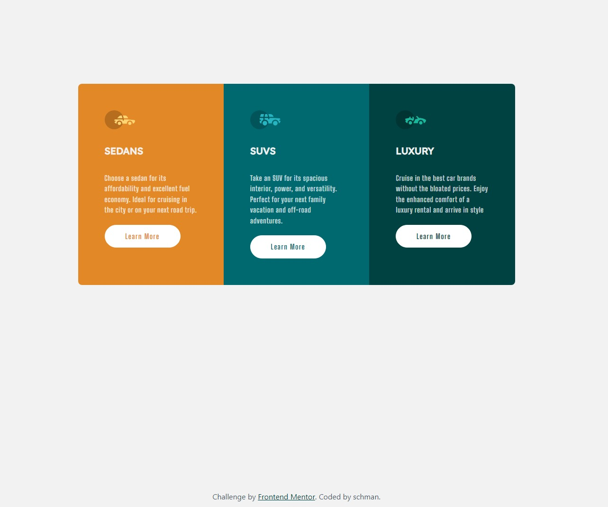

# Frontend Mentor - 3-column preview card component solution

This is a solution to the [3-column preview card component challenge on Frontend Mentor](https://www.frontendmentor.io/challenges/3column-preview-card-component-pH92eAR2-). Frontend Mentor challenges help you improve your coding skills by building realistic projects.

## Table of contents

- [Overview](#overview)
  - [The challenge](#the-challenge)
  - [Screenshot](#screenshot)
  - [Links](#links)
- [My process](#my-process)
  - [Built with](#built-with)
  - [What I learned](#what-i-learned)
- [Author](#author)

## Overview

### The challenge

Users should be able to:

- View the optimal layout depending on their device's screen size
- See hover states for interactive elements

### Screenshot

### Links

- Live Site URL: [Add live site URL here](https://your-live-site-url.com)

## My process

### Built with

- Semantic HTML5 markup
- CSS Grid
- Mobile-first workflow
- [TailwindCSS](https://tailwindcss.com)

### What I learned

I used the first time CSS grid, with tailwindcss its realy simple. I used CSS grid to center the whole container and aranged the "cards" for responsiveness. I also used transitions for the hover (buttons).

## Author

- Website - [schman](https://schman.at)
- Frontend Mentor - [@schmanat](https://www.frontendmentor.io/profile/schmanat)
